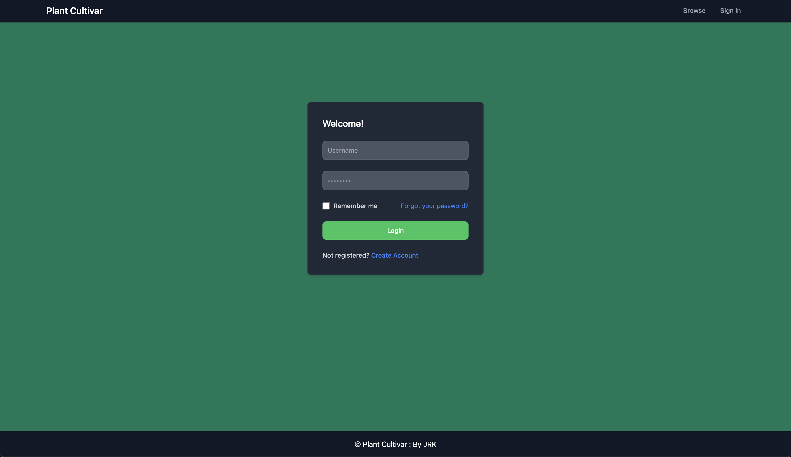
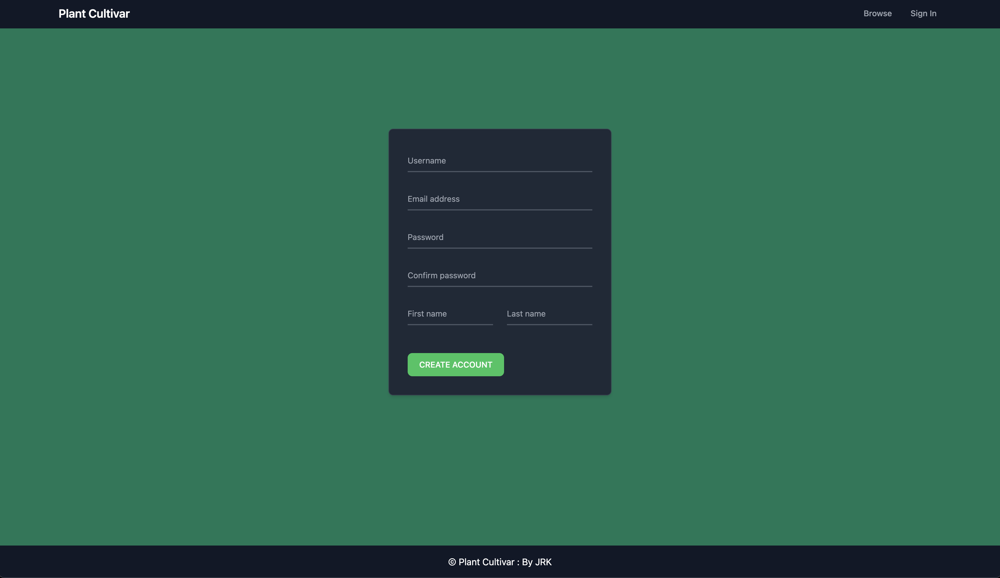
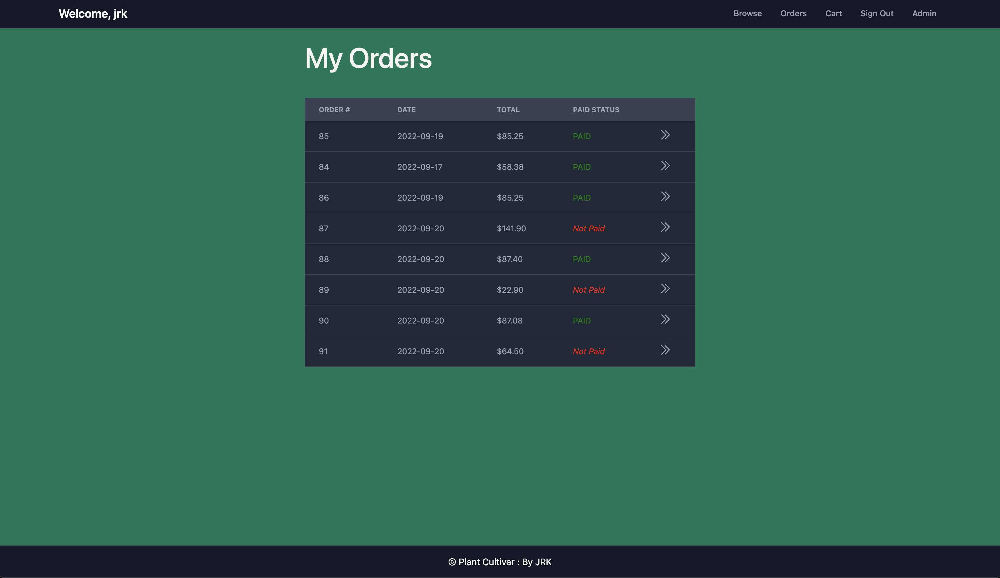
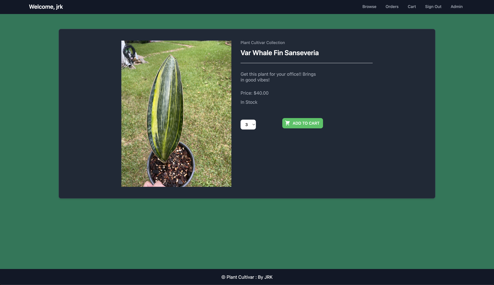
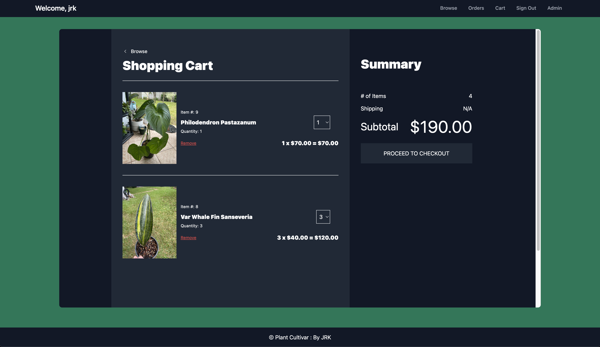
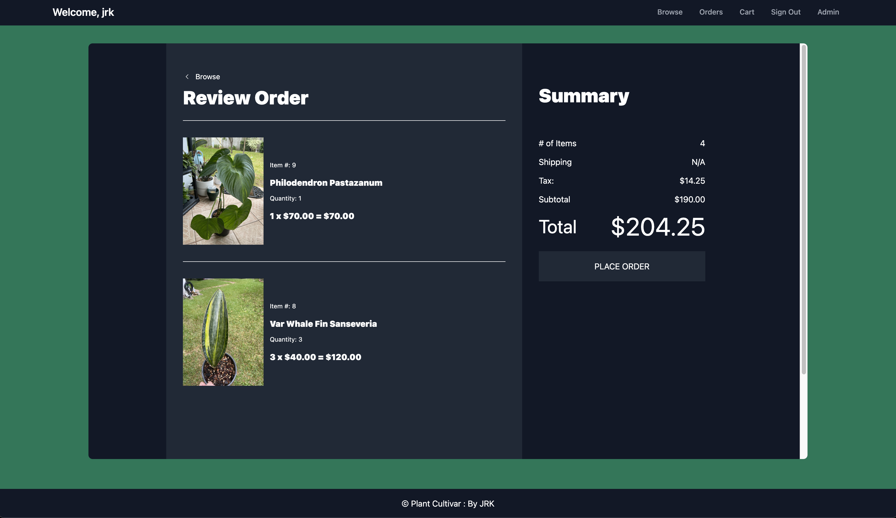
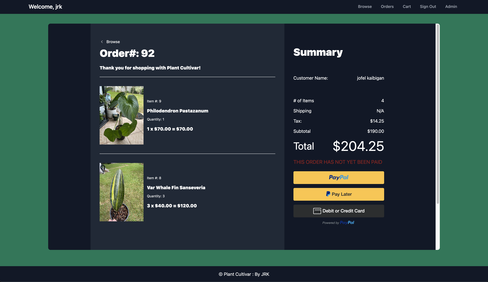
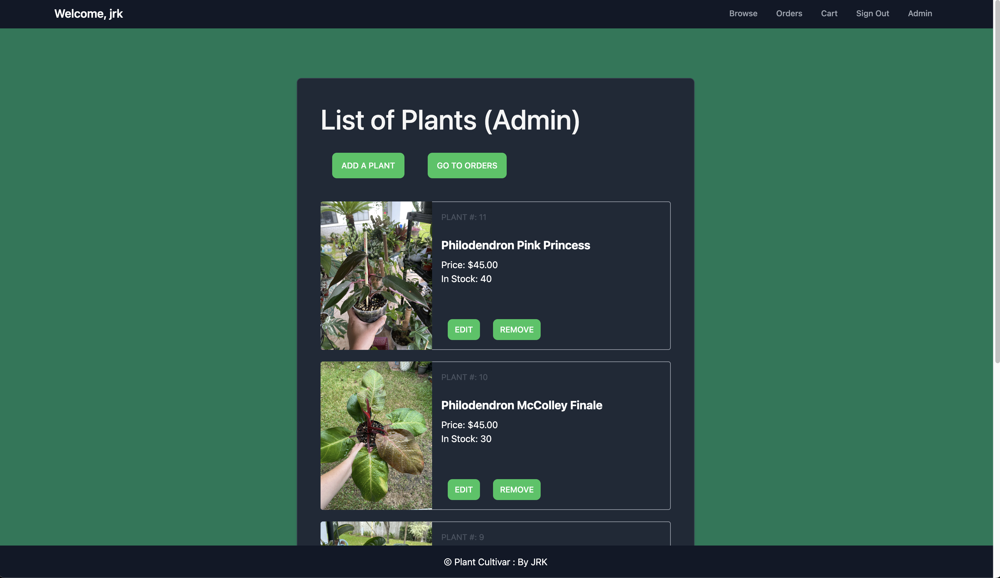
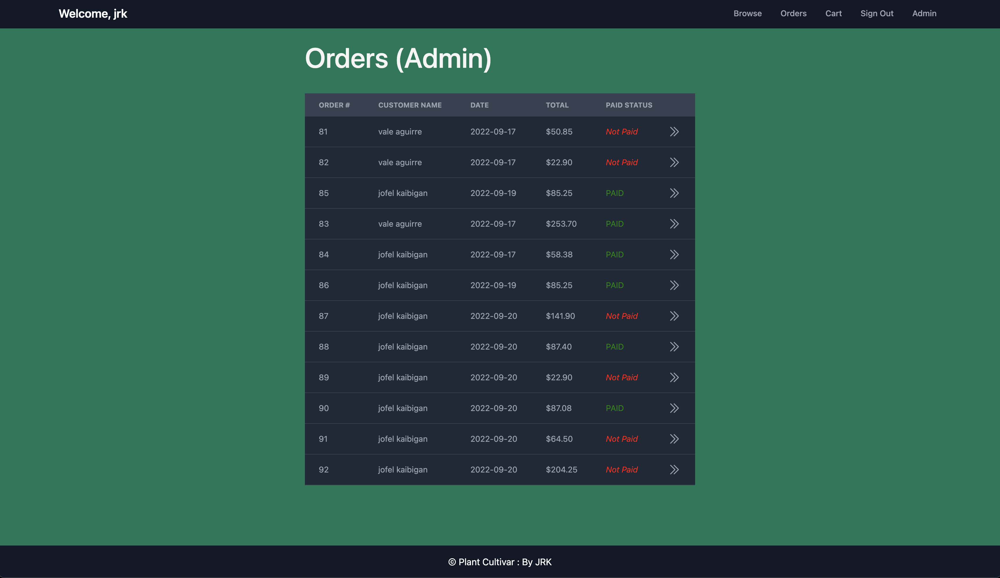

Plant Cultivar

### Project Description

Plant Cultivar is the name of my mother's small business and this ecommerce application is created to help her manage her orders and allows her customers to browse and purchase her products online.

### Technologies Used

JavaScript, React, Redux, Python, Django, simpleJWT, PayPal API, Tailwind CSS, Pillow, AWS S3, 

### Features Implemented
- Used Redux to manage global states with cart functionality, user authentication, and axios requests.
- Implemented the PayPal API to allow customers to make PayPal / Venmo or debit / credit payments to place orders.
- Configured AWS S3 to allow admin users upload and store images of their products to the store.

### SCREENSHOTS:

Login Page:

Signup Page:

Index page that displays all the plants for sale.

Displays all the orders placed by the user, the status of the order, and the date the order was placed.

Gives user the option to add to cart and select the quantity. Also lets users see a description of the plant set by the Admin.

Addt to Cart redirects to the shopping cart page that lists the items that are currently in the user's cart.

Order Review before placing order. Gives details on tax, shipping cost (if applicable), and number of items.

Order details page where customers can process card payments through PayPal.

List of Plants where admin users can edit/remove/add plants to the store.

Lists all the orders placed by all the customers for admin users to see.

### User Stories

MVP:

As the admin user, there should be CRUD on the available plants for sale
 
As a user, I would like to see the available plants that are posted.
 
As a user, I would like to add items to a cart before placing the order.
 
As a user, I would like to edit the cart on the cart page.
 
As a user, I want to be able to place orders for the plants (pickup/delivery).
 
As a user, I want to be able to sign in and create a new account (Token Authorization).
 

Stretch Goals:

As the admin user, there should be a 'delivery routes' page that displays the current orders that need to be delivered. (Also a list view. Google Maps)
 
As a user, I would like to be able to contact the seller via Chatbox feature.
 
Admin users can view the profits of every transaction.
 
Admin users can see a graph of profits over the course of the day, the week, the month, the quarter, the year.
 
Admin users should approve/disapprove orders that have been placed.
 
Users should get an email confirmation of their order.
 
Users should make the payment for the order for delivery transactions on the website. (Stripe API)
 
Categorize the items in the store.
 
Search and filter function for the items in the store.
 
Use Google Maps API to be able to route the most efficient path for all the deliveries.

### Wireframes

 

For more info, check out the Backend README file.